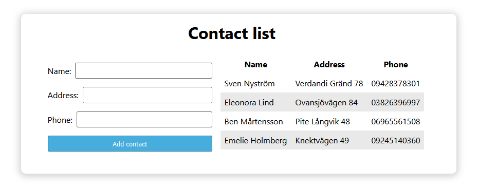

# Contacts list

----

## Assignment

Your assignment is to develop a web application for keeping track of contacts. For the application, a few requirements have been specified describing the minimum viable product (MVP). In addition, there is a list of suggested extra features that may be implemented. All requirements and extra features are listed in the document `requirements-and-features.md`. If you have your own ideas of features you'd like to add to the application, feel free to do so, and don't forget to list them under **Your own features** in that document.

The final product will look something like this, but you are of course free to style the application however you like!



Add your implementation of the web app to the `frontend` folder. Once you are finished with the assignment, please fill in some instructions on how to get the web application up and running under **[Startup instructions](#startup-instructions)**.

**Important:** After implementing a requirement or extra feature, mark it as implemented in document `requirements-and-features.md` by adding an `x` within the brackets for the corresponding item. For example:

> ```markdown
> - [x] When clicking the "Add contact" button, the form must be cleared.
> ```

----

## Startup instructions

Run npm start in the frontend folder and the backend folder in two separate terminal windows.

----

## Contact

For any questions or feedback, feel free to send an email to [daniel.wassbjer@i3tex.com](mailto:daniel.wassbjer@i3tex.com).
